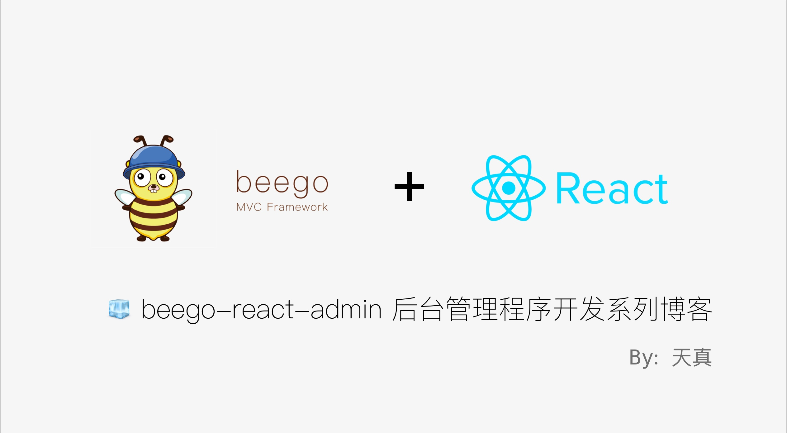

<!--
 * @Author: Bin
 * @Date: 2022-02-15
 * @FilePath: /react-admin/README.md
-->
# beego-react-admin
> 🧊 基于 Beego + React 搭建的一套 beego-react-admin 后台管理程序模版



### 相关博客
如何使 Beego 加载 React 框架以及初步搭建前端项目结构：<https://bin.zmide.com/?p=1017>
### 前端目录结构
```
.
├── components                  // 网站通用组件
│   └── index.ts
├── config.ts                   // 网站通用配置项 
├── index.ts
├── pages                       // 网站页面对应
│   ├── index                   // index 页面
│   │   ├── index.tsx           // index 入口文件
│   │   └── scss                // index 页面 scss 样式目录
│   │       └── index.scss
│   └── login                   // login 页面
└── utils                       // 网站通用工具函数
    └── index.ts
```